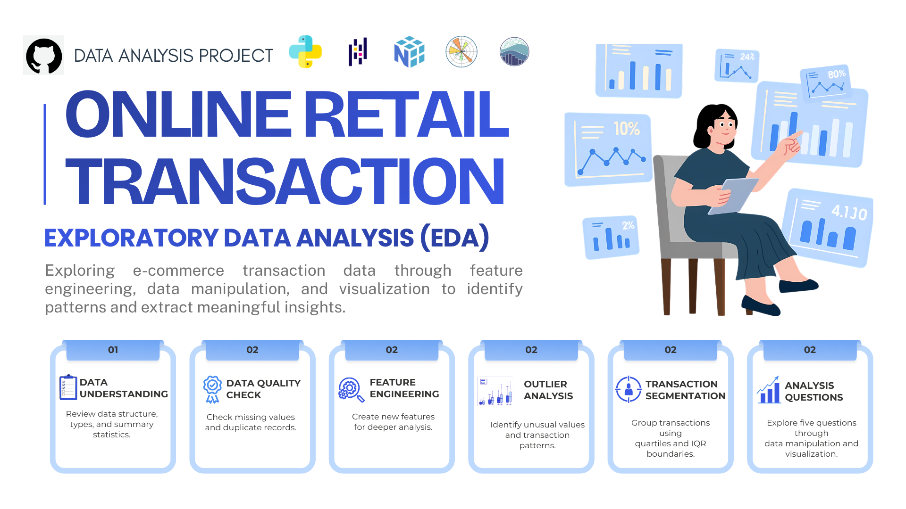

# Online Retail Transaction — Exploratory Data Analysis

  

## Project Context

Online retail transaction data provides valuable information about purchasing activity, product performance, and revenue contribution. This project explores e-commerce transaction data to identify revenue patterns and examine the key factors associated with revenue performance across transaction segments.

## Problem

A high number of transactions does not necessarily generate the highest revenue. This analysis examines which transaction segments contribute the most revenue and explores the products, transaction values, geographic markets, and monthly trends behind their performance.

## Project Resources

- **Dataset:** [View Dataset](https://docs.google.com/spreadsheets/d/1wkqIxc3xv4Rb7xQdmwAtKumzo6iLyIn15zIbfLA46zk/edit?usp=sharing)
- **Analysis Worksheet:** [View Analysis in Google Colab](https://colab.research.google.com/gist/gmustika1312-svg/5192aff4fc9d6d66b04577ae76d1f043/assignment_day_20_advanced_exploratory_data_analysis_ggmu.ipynb)

## Analysis Workflow

The EDA workflow was conducted to understand the transaction data, prepare relevant features, and explore revenue patterns through a structured analysis process.

**01 — Data Understanding**  
Explore the dataset and understand its characteristics.

**02 — Data Quality Check**  
Review data completeness and record consistency.

**03 — Feature Engineering**  
Prepare additional variables for further analysis.

**04 — Outlier Analysis**  
Examine extreme values within numerical variables.

**05 — Transaction Segmentation**  
Classify transactions into four value-based segments.

**06 — Analysis Questions**  
Investigate revenue patterns through five analytical questions.

## Analysis Questions

1. Which transaction segment contributes the most to total revenue?
2. Which products contribute the most revenue within the Premium segment?
3. Is the high revenue of the Premium segment driven by transaction frequency or transaction value?
4. Which countries contribute the most revenue within the Premium segment?
5. How does Premium segment revenue trend throughout 2011?

## Key Findings

- The **Premium segment contributes 52.79% of total revenue**, making it the largest revenue contributor.
- **WHITE HANGING HEART T-LIGHT HOLDER** is the top revenue-contributing product in the Premium segment at **6.42%**, followed by CREAM HEART CARD HOLDER and SWEETHEART BIRD HOUSE.
- Despite having only **343 transactions**, the Premium segment records the highest median transaction value at **88.80**, showing that revenue is driven more by transaction value than transaction frequency.
- The **United Kingdom contributes 81.15% of Premium revenue**, indicating a high concentration in one market.
- Premium revenue fluctuates throughout 2011 and reaches its highest point in **November at 9,983.69**, following stronger performance from August to November.

## Key Visualizations

  
  
  

## Recommendations

- Encourage high-value transactions within the Premium segment and increase transaction values across other segments.
- Maintain the availability of key products and apply product bundling to increase purchase value.
- Develop Premium segment market opportunities in the Netherlands, EIRE, and Germany.
- Align promotional, inventory, and sales planning with increased purchasing activity from August to November.

## Tools

Python · Pandas · NumPy · Matplotlib · Seaborn · Google Colab
