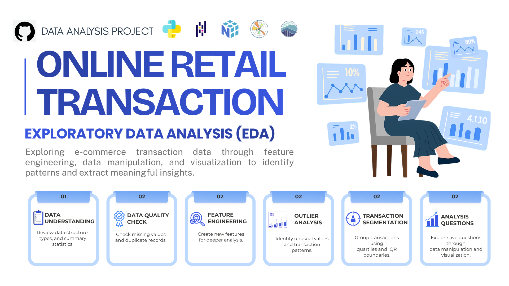

<p align="center">
  
</p>

# Online Retail Transaction — Exploratory Data Analysis


## Project Overview

This project explores e-commerce transaction data using Exploratory Data Analysis (EDA) to identify transaction patterns and revenue drivers.

The analysis covers data understanding, data quality checking, feature engineering, outlier analysis, transaction segmentation, data manipulation, and visualization. Five analytical questions were developed to examine revenue contribution, product performance, transaction behavior, geographic contribution, and revenue trends.

## Analysis Workflow

1. **Data Checking**  
   Review dataset structure, data types, missing values, and duplicate records.

2. **Data Cleaning**  
   Evaluate data quality and identify invalid or incomplete records.

3. **Feature Engineering**  
   Create additional features to support transaction and revenue analysis.

4. **Outlier Analysis**  
   Identify unusual values in Quantity, UnitPrice, and TotalPrice using the IQR method.

5. **Transaction Segmentation**  
   Group transactions into Low, Medium, High, and Premium segments based on transaction value.

6. **Pattern Exploration**  
   Explore revenue contribution, product performance, transaction behavior, geographic distribution, and monthly trends.

## Tools

- Python
- Pandas
- NumPy
- Matplotlib
- Seaborn
- Jupyter Notebook

## Analytical Questions

The analysis focuses on five questions:

1. Which transaction segment contributes the most to total revenue?
2. Which products contribute the most revenue within the leading segment?
3. Is high revenue in the Premium segment driven by transaction frequency or transaction value?
4. Which countries contribute the most revenue to the Premium segment?
5. How does Premium segment revenue change throughout 2011?

## Key Insights

### 1. Premium Segment Dominates Revenue

The **Premium segment contributes 52.79% of total revenue**, making it the largest revenue contributor.

Despite its strong revenue contribution, the Premium segment records only **343 transactions**, the lowest transaction count among all segments.

This indicates that revenue is primarily driven by **higher transaction values rather than transaction frequency**.


### 2. Top Revenue-Contributing Products

Within the Premium segment, **WHITE HANGING HEART T-LIGHT HOLDER** generates the highest revenue contribution at **6.42%**.

Other major contributors include:

- CREAM HEART CARD HOLDER
- SWEETHEART BIRD HOUSE

These findings indicate that home decoration products contribute significantly to Premium segment revenue.


### 3. Transaction Value Drives Premium Revenue

The Medium segment records the highest transaction volume with **1,970 transactions**.

However, the Premium segment has the highest median transaction value at **88.80**, compared with:

- High: 28.26
- Medium: 14.50
- Low: 2.95

The results show that increasing transaction value has a stronger impact on revenue than transaction frequency.

### 4. United Kingdom Leads Premium Revenue

The **United Kingdom contributes 81.15% of Premium segment revenue**.

Other markets such as the Netherlands, EIRE, and Germany contribute significantly smaller proportions.

This indicates a strong geographic concentration of Premium revenue in the United Kingdom.


### 5. Premium Revenue Peaks in November

Premium segment revenue fluctuates throughout 2011.

Revenue gradually increases from June to August, declines during September and October, and reaches its highest level in **November at 9,983.69**.

The period from August to November shows relatively strong purchasing activity and may provide opportunities for promotional and inventory planning.


## Business Recommendations

Based on the analysis:

- Retain Premium customers through loyalty programs and personalized offers.
- Encourage High-segment customers to increase their transaction value and move toward the Premium segment.
- Maintain stock availability for high-revenue products.
- Explore product bundling opportunities for top-performing home decoration products.
- Expand Premium customer engagement in markets outside the United Kingdom.
- Prepare promotional and inventory strategies ahead of high-revenue periods, particularly from August to November.

## Conclusion

The analysis shows that the Premium segment is the main revenue contributor, accounting for **52.79% of total revenue**.

Premium revenue is driven primarily by high transaction values rather than transaction frequency. Revenue is also concentrated among several key products and is heavily dominated by customers from the United Kingdom.

Revenue trends throughout 2011 indicate stronger purchasing activity between August and November, with the highest revenue recorded in November.

These findings highlight opportunities to strengthen customer retention, increase transaction value, improve product strategies, and expand Premium segment contribution across other markets.

## Repository Structure

```text
online-retail-eda/
│
├── README.md
├── online_retail_eda.ipynb
│
├── data/
│   └── ecommerce.csv
│
└── images/
    ├── cover.jpg
    ├── transaction_segment.png
    ├── product_performance.png
    ├── country_contribution.png
    └── revenue_trend.png
